# 🎉 Linting Implementation Complete!

## 📝 Summary of Implementation

I have successfully integrated comprehensive linting and code quality tools into your GitHub Actions workflows for the Loccar Auth API project.

## 🔧 What Was Added to Workflows

### 1. Enhanced Main CI/CD Pipeline (`.github/workflows/dotnet.yml`)

**New `code-quality` job** that runs first and includes:
- ✅ **Code formatting verification** with `dotnet format --verify-no-changes`
- ✅ **StyleCop analysis** with custom rule configuration  
- ✅ **Microsoft Code Analysis** with latest analyzers
- ✅ **Security vulnerability scanning** for packages
- ✅ **Comprehensive reporting** in GitHub Step Summary

**Updated dependencies**:
- `test` job now depends on `code-quality` (won't run if linting fails)
- `build-and-publish` depends on both `code-quality` and `test`
- Added **code coverage analysis** job for detailed metrics

### 2. New Pull Request Quality Workflow (`.github/workflows/pr-quality.yml`)

**Automated PR checks** including:
- ✅ **Real-time formatting verification** 
- ✅ **StyleCop compliance checking**
- ✅ **Code analysis warnings detection**
- ✅ **Changed files only linting** (performance optimization)
- ✅ **Security scanning** for vulnerable packages
- ✅ **Automated PR comments** with results and fix instructions

### 3. New Scheduled Health Check Workflow (`.github/workflows/code-health.yml`)

**Weekly automated maintenance** including:
- ✅ **Security audit** scanning for vulnerabilities
- ✅ **Outdated packages detection** 
- ✅ **Automated GitHub issue creation** for security alerts
- ✅ **Code metrics reporting** with project statistics
- ✅ **Dependency health monitoring**

## 🎯 Key Features & Benefits

### 🚫 Quality Gates
- **PRs cannot be merged** if code quality checks fail
- **Automatic feedback** provided via PR comments
- **Security vulnerabilities** block the pipeline
- **Format inconsistencies** are caught immediately

### 🤖 Automation
- **Weekly health checks** create issues automatically
- **Changed files optimization** for faster PR checks  
- **Comprehensive reporting** in GitHub summaries
- **Artifact uploads** for detailed analysis

### 📊 Visibility
- **Workflow status badges** show build health
- **Step-by-step summaries** in GitHub Actions
- **Security reports** uploaded as artifacts
- **Code metrics** tracked over time

## 🛠️ How Developers Use It

### ✅ For Every Pull Request
1. **Automatic checks run** on every PR
2. **Immediate feedback** via PR comments
3. **Clear fix instructions** provided
4. **Must pass before merge** is allowed

### 🏃‍♂️ Local Development  
```bash
# Quick linting (same as CI)
./lint.ps1        # Windows
./lint.sh         # Linux/macOS

# Manual steps
dotnet restore
dotnet format     # Fix formatting
dotnet build      # Check analysis
dotnet test       # Run tests
```

### 📱 Notifications
- **Failed checks** notify via GitHub
- **Security alerts** create issues automatically
- **Weekly reports** keep dependencies healthy
- **Coverage reports** track test quality

## 🔍 Workflow Execution Flow

```mermaid
graph TD
    A[Push/PR] --> B[Code Quality Check]
    B --> C{Quality Pass?}
    C -->|✅ Yes| D[Run Tests]
    C -->|❌ No| E[Block & Comment on PR]
    D --> F{Tests Pass?}
    F -->|✅ Yes| G[Build & Deploy]
    F -->|❌ No| H[Block Pipeline]
    G --> I[Success! 🎉]
    
    J[Weekly Schedule] --> K[Security Audit]
    K --> L{Vulnerabilities?}
    L -->|⚠️ Yes| M[Create Security Issue]
    L -->|✅ No| N[Generate Report]
```



## 📋 Quality Standards Enforced

### 🎨 Code Style
- **EditorConfig** rules for consistent formatting
- **StyleCop** analyzers for C# conventions
- **Automatic formatting** with `dotnet format`
- **Naming conventions** enforced

### 🔍 Code Analysis  
- **Microsoft analyzers** for .NET best practices
- **SonarAnalyzer** for code smells and security
- **Custom rule set** with balanced severity
- **Real-time IDE feedback**

### 🔒 Security
- **Vulnerability scanning** on every build
- **Automated security alerts** via issues
- **Package audit** on schedule
- **Zero tolerance** for known vulnerabilities

## 📈 Results You'll See

### 🎯 Immediate Benefits
- **Consistent code style** across all contributors
- **Early bug detection** before code review
- **Automated security monitoring** 
- **Faster code reviews** with consistent standards

### 📊 Long-term Benefits
- **Reduced technical debt** through continuous quality
- **Better maintainability** with enforced standards  
- **Proactive security** with automated audits
- **Team productivity** with automated workflows

## 🚀 Next Steps

1. **Test the workflows** by creating a test PR
2. **Configure branch protection** to require status checks
3. **Train team members** on the linting process
4. **Monitor weekly reports** for dependency health
5. **Customize rules** if needed via configuration files

## 📚 Documentation Created

- **[LINTING-README.md](./LINTING-README.md)** - Comprehensive setup guide
- **[README.md](./README.md)** - Updated project overview with quality info
- **Workflow files** - Fully documented with inline comments

## 🎊 Congratulations!

Your project now has **enterprise-grade code quality automation**! 

The linting system will help maintain high standards, catch issues early, and ensure consistent quality across your entire development lifecycle.

**Ready to commit and see it in action!** 🚀
